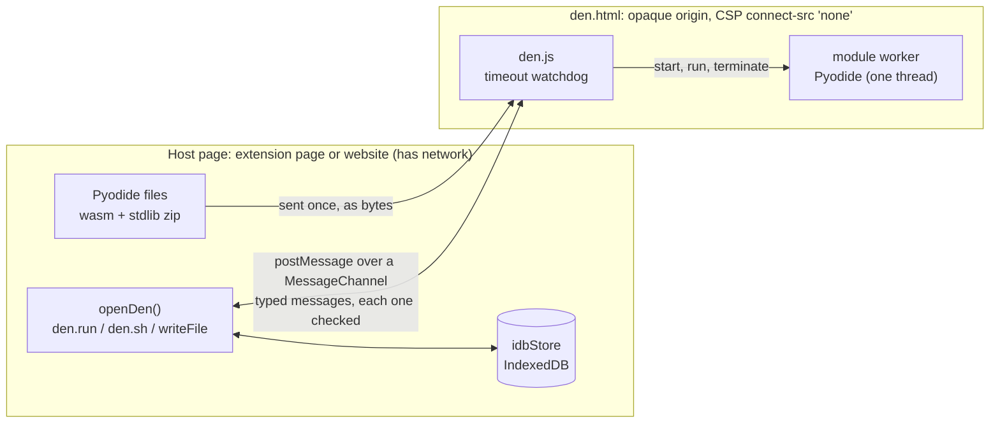
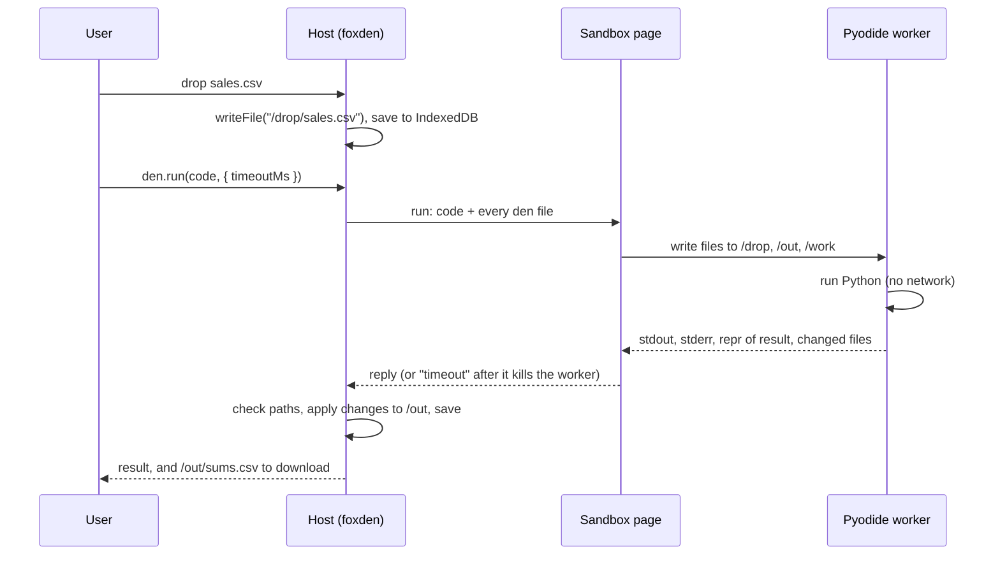
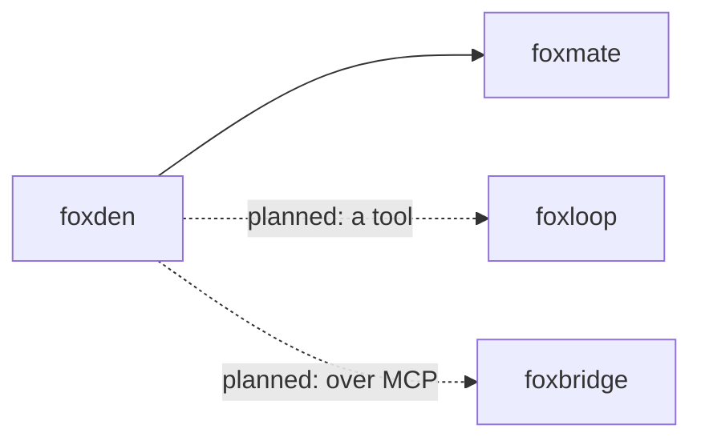

# foxden

A sandbox in a browser tab that runs Python and shell with no network.

foxden gives each "den" its own folder of files and its own Python. The Python
is [Pyodide](https://pyodide.org) (CPython compiled to WebAssembly). It runs in
a worker inside a sandboxed page. That page has an opaque origin and the CSP
`connect-src 'none'`, so code in it cannot reach any server. You put files in
`/drop`, run code, and take the results from `/out`.

## Install

```bash
npm i @pooriaarab/foxden
```

The npm package is `@pooriaarab/foxden`: npm refuses the plain name `foxden` as too similar to an existing package (`boxen`).

foxden installs `pyodide` 314.0.7 next to it. Your page must serve two
folders: the sandbox page from foxden, and three files from Pyodide. Copy them
when you build:

```bash
mkdir -p public/foxden/pyodide
cp -r node_modules/@pooriaarab/foxden/dist/den public/foxden/
cp node_modules/pyodide/pyodide.asm.wasm node_modules/pyodide/python_stdlib.zip node_modules/pyodide/pyodide-lock.json public/foxden/pyodide/
```

Use the Pyodide files of version 314.0.7. The loader inside `den.js` is that
version, and files from another version do not work with it. With pnpm,
`node_modules/pyodide` exists only when you also run `pnpm add pyodide@314.0.7`.

## Example

```js
import { idbStore, iframeRuntime, openDen } from "@pooriaarab/foxden";

const den = await openDen({
  name: "notes",
  store: idbStore(),
  runtime: iframeRuntime({ denUrl: "/foxden/den/den.html", pyodideUrl: "/foxden/pyodide/" }),
});

await den.writeFile("/drop/sales.csv", "region,amount\nnorth,10\nsouth,20\n");
const run = await den.run(
  `
import csv
rows = list(csv.DictReader(open("/drop/sales.csv")))
sum(float(row["amount"]) for row in rows)
`,
  { timeoutMs: 5000 },
);
console.log(run.result); // 30.0

const sh = await den.sh("grep north /drop/sales.csv");
console.log(sh.stdout); // north,10
```

This runs in a browser page (through a bundler) and in a Firefox extension
page. It does not run in Node, because it needs an iframe.

## Use cases

| Who | What they build | How foxden helps |
|---|---|---|
| A person with a private spreadsheet | A tab that sums, filters, or cleans a CSV | The file stays in the browser. Code cannot send it anywhere, because the sandbox has no network. |
| A developer of a local AI agent | A "code interpreter" tool for the agent | The agent writes Python. foxden runs it with a time limit and returns stdout, stderr, the result, and the changed files. Model-written code never runs in the extension itself. |
| A teacher | A Python lesson page that needs no install and no server | Each student gets a den in their own tab. A loop that never ends stops at the time limit. |
| A documentation team | "Try it" boxes on a docs site | The reader's device runs the examples. The site needs only static files, no code-execution server. |
| A person who must convert a file | A page that turns JSON into CSV, or splits a large text file | The conversion runs locally. There is no need to upload the file to an unknown converter site. |
| A security analyst | A place to open a suspicious text, CSV, or log file offline | Code that parses the file has no network and no extension API. A snapshot keeps the file set for later. |
| A website owner | Heavy work on the visitor's device ("bring your own compute") | The site serves the sandbox page and Pyodide. The visitor's CPU does the work, and the data stays with the visitor. |

## How it works

The page that opens a den (the host) owns the files. For each run, it sends
the code and a copy of the files to the sandbox page. The sandbox page sends
back the output and the files that changed. The host checks every path and
saves the files in its store.



A run moves files from `/drop` to `/out`:



The sandbox page is isolated in one of two ways:

- **`manifest-sandbox`** (Firefox 154 and later, in an extension). The
  extension lists `den.html` in the manifest
  [`sandbox`](https://developer.mozilla.org/en-US/docs/Mozilla/Firefox/Releases/154)
  key, with its own CSP. The host loads it in a plain iframe. The E2E test
  checks this mode on Firefox 157.
- **`iframe-sandbox`** (websites, and Firefox 153). The host loads `den.html`
  in an iframe with `sandbox="allow-scripts"`. The `<meta>` CSP in `den.html`
  blocks the network.

`iframeRuntime` picks the mode. Before it loads Pyodide, `den.html` checks that
its origin is opaque and that it has no extension API. If the check fails, it
refuses to start, and `iframeRuntime` tries `iframe-sandbox` instead.

What we found in Firefox 157 while we built this: the manifest sandbox CSP
applies only when the iframe has no `sandbox` attribute. With the attribute,
Firefox did not apply the manifest CSP, and `fetch`, `XMLHttpRequest` and
`WebSocket` calls from the page reached a local probe server. foxden
therefore keeps the `<meta>` CSP in `den.html` in every mode.

When a run passes `timeoutMs`, `den.html` terminates the worker and starts a
new one. Files survive, because the host owns them. Python variables do not.
If the sandbox page itself stops answering, the host removes the iframe and
starts a new runtime.

## What "shell" means here

`den.sh()` is not bash, and it does not run in the sandbox. It is a small
command language that reads the den files in the host page. It has `ls`,
`cat`, `head [-n N]`, `wc [-l|-w|-c]`, `grep [-i|-v|-c|-n]` and `echo`, joined
by `|`, with single and double quotes. `grep` matches plain text, not regular
expressions. Any other syntax (`;`, `&&`, `>`, `$`, `*`) gives exit code 2
and runs nothing. To write files, use Python.

## API

```ts
import { openDen, iframeRuntime, idbStore, memoryStore, runShell, normalizePath,
         encodeSnapshot, decodeSnapshot } from "@pooriaarab/foxden";
```

| Name | What it does |
|---|---|
| `openDen({ name, runtime, store?, snapshot?, maxDenBytes?, killGraceMs? })` | Opens a den and starts its runtime. `name` is 1-64 ASCII letters, digits, `-` or `_`. Rejects with `DenLoadError` when the runtime does not start. One name can be open once per page. |
| `den.run(code, { timeoutMs?, maxOutputBytes? })` | Runs Python. Returns `{ stdout, stderr, result, error, truncated, files, durationMs }`. `result` is the `repr()` of the last expression, or `null`. `error.kind` is `python`, `timeout`, `crashed`, or `storage`. Defaults: 30 s, 1 MiB. |
| `den.sh(command)` | Runs the shell above. Returns `{ stdout, stderr, code, truncated }`. |
| `den.writeFile(path, data)` / `den.readFile(path)` / `den.deleteFile(path)` / `den.list()` | Files under `/drop`, `/out`, and `/work`. A path with `..` throws `PathError`. |
| `den.snapshot()` / `den.restore(bytes)` | Packs all files into bytes with a SHA-256 for each file, and reads them back. Corrupt bytes throw `SnapshotError` and change nothing. Python variables are not in a snapshot. |
| `den.fork({ name })` | Opens a new den with a copy of the files. |
| `den.close()` | Removes the iframe and frees the name. |
| `den.info` | `{ kind, isolation, loadMs }` of the current runtime. |
| `iframeRuntime({ denUrl, pyodideUrl, isolation?, loadTimeoutMs?, container? })` | The default runtime. `isolation` is `"auto"`, `"manifest-sandbox"`, or `"iframe-sandbox"`. |
| `idbStore(dbName?)` / `memoryStore()` | Where the files live between page loads. The default is `memoryStore()`. |

`runtime` is an adapter: any object with `start()`, `run(request)`, and
`close()` can replace `iframeRuntime`. We checked
[BrowserPod](https://browserpod.io) as a second adapter. Its npm package is
proprietary ("All Rights Reserved"), so foxden does not include it.

Errors have a stable `name`: `PathError`, `SnapshotError`, `DenError`,
`DenLoadError`. foxden has no CLI and no MCP server.

### Use it in an extension

Copy `den/` and the Pyodide files into your extension, then add this to
`manifest.json`:

```json
{
  "sandbox": { "pages": ["den/den.html"] },
  "content_security_policy": {
    "extension_pages": "script-src 'self'; object-src 'none'",
    "sandbox": "sandbox allow-scripts; default-src 'none'; script-src 'self' 'wasm-unsafe-eval'; worker-src blob:; connect-src 'none'"
  }
}
```

`worker-src blob:` is needed because a page with an opaque origin cannot
start a worker from a URL. `den.js` starts it from a string that is part of
the file. `web-ext lint` warns about this CSP, and about the `sandbox` key
when `strict_min_version` is below 154. See `scripts/lint-ext.mjs`.

### Use it on a website

Serve `den/` and the Pyodide files from your site, and call `iframeRuntime`
with their URLs. foxden uses `iframe-sandbox` there. Serve
`pyodide.asm.wasm` with any content type: the host reads it as bytes.

## Demo extension

`extension/` holds the demo. Its toolbar button opens the Space tab. Drop a
CSV, press Run, and the sample code counts the rows, sums each number column,
and writes `/out/sums.csv` for download. The badge says "Network: off".

```bash
pnpm install
pnpm build && pnpm build:ext   # writes dist-ext/ (about 15 MB)
pnpm e2e                       # the extension in real Firefox
pnpm e2e:web                   # the website case in real Firefox
```

Both E2E tests send all remote traffic to a dead proxy, so Pyodide must load
from local files. They try `fetch`, `XMLHttpRequest`, `WebSocket`,
`EventSource`, `import()`, and a nested worker against a local probe server,
and expect zero requests. They write `artifacts/e2e-<date>.json` and
`artifacts/e2e-web-<date>.json`. On an Apple silicon Mac with Firefox 157,
Pyodide loads in about 1.5 to 2.5 seconds.

## Firefox APIs used

| API | Why |
|---|---|
| [`sandbox` manifest key](https://developer.mozilla.org/en-US/docs/Mozilla/Firefox/Releases/154) (Firefox 154) | An extension page with an opaque origin and no extension API. |
| [`content_security_policy`](https://developer.mozilla.org/en-US/docs/Mozilla/Add-ons/WebExtensions/manifest.json/content_security_policy) (`sandbox`) | `connect-src 'none'` and `worker-src blob:` for the sandbox page. |
| [`<iframe sandbox>`](https://developer.mozilla.org/en-US/docs/Web/HTML/Reference/Elements/iframe#sandbox) | The isolation on websites and on Firefox 153. |
| [CSP `connect-src`](https://developer.mozilla.org/en-US/docs/Web/HTTP/Reference/Headers/Content-Security-Policy/connect-src) in a `<meta>` tag | Blocks the network in every mode. A worker made from a blob URL gets the same CSP. |
| [`Worker`](https://developer.mozilla.org/en-US/docs/Web/API/Worker/Worker) (`type: "module"`) and [`terminate()`](https://developer.mozilla.org/en-US/docs/Web/API/Worker/terminate) | Runs Pyodide off the page thread, and kills code that runs too long. |
| [`URL.createObjectURL`](https://developer.mozilla.org/en-US/docs/Web/API/URL/createObjectURL_static) | The worker script, and the download links for `/out` files. |
| [`MessageChannel`](https://developer.mozilla.org/en-US/docs/Web/API/MessageChannel) and [`postMessage`](https://developer.mozilla.org/en-US/docs/Web/API/Window/postMessage) | The only link between the host and the sandbox page. |
| [WebAssembly](https://developer.mozilla.org/en-US/docs/WebAssembly) and `'wasm-unsafe-eval'` | Runs Pyodide. One thread only. |
| [IndexedDB](https://developer.mozilla.org/en-US/docs/Web/API/IndexedDB_API) | `idbStore` keeps den files across reloads. |
| [`SubtleCrypto.digest`](https://developer.mozilla.org/en-US/docs/Web/API/SubtleCrypto/digest) | The SHA-256 of each file in a snapshot. |
| [`runtime.getManifest`](https://developer.mozilla.org/en-US/docs/Mozilla/Add-ons/WebExtensions/API/runtime/getManifest) | `iframeRuntime` checks if `den.html` is in the `sandbox` key. |
| [`action.onClicked`](https://developer.mozilla.org/en-US/docs/Mozilla/Add-ons/WebExtensions/API/action/onClicked) and [`tabs.create`](https://developer.mozilla.org/en-US/docs/Mozilla/Add-ons/WebExtensions/API/tabs/create) | The demo opens the Space tab. |
| [Drag and drop](https://developer.mozilla.org/en-US/docs/Web/API/HTML_Drag_and_Drop_API) and `<input type="file">` | The demo fills `/drop`. |
| [`unlimitedStorage`](https://developer.mozilla.org/en-US/docs/Mozilla/Add-ons/WebExtensions/manifest.json/permissions) | Firefox does not evict the demo's files. |

foxden does not use `SharedArrayBuffer` or WebAssembly threads. Firefox does
not give them to extension pages. It does not use OPFS or JSPI yet.

## Limits

- Python runs on one thread, at WebAssembly speed. Heavy number work is
  slower than native Python.
- The download is large: about 12 MB of Pyodide files, plus 1.6 MB for
  `den.js`. Each den loads its own copy of Pyodide, in 1.5 to 2.5 seconds.
- Only the Python standard library is there. pandas and NumPy are not
  bundled, and the sandbox cannot download packages.
- A timeout kills the worker, so Python variables are lost. Files stay.
- When a run ends, foxden cancels the asyncio tasks that the code started.
  If a task or a JavaScript timer is still alive 200 ms later, the worker
  restarts, and Python variables are lost. Files stay.
- Snapshots hold files only, not Python variables.
- Each run copies every den file to the sandbox and back. Very large dens
  are slow. The default cap is 256 MiB per den.
- Two pages that open the same den name at once both write to IndexedDB. The
  last save wins.
- The AMO policy says add-ons must not "load remote code for execution". It
  does not say if Python that a user or a model writes, run in a bundled
  interpreter, counts. This question is open. foxden bundles Pyodide and
  runs all such code only in the sandbox page.
- The `iframe-sandbox` fallback for Firefox 153 is tested on Firefox 157 with
  the attribute (the website E2E test), not on a real Firefox 153.
- The memory limit is the WebAssembly limit (4 GB). Code that asks for more
  gets a `MemoryError`, but it can use that much RAM before it does.
- Only Firefox runs the E2E tests. The package is not on npm yet.

## Part of the fox primitives



foxden depends on no other fox repo.
[foxmate](https://github.com/pooriaarab/foxmate) will use it as its code
sandbox. [foxloop](https://github.com/pooriaarab/foxloop) and
[foxbridge](https://github.com/pooriaarab/foxbridge) can call it as a tool.

## License

MIT. Pyodide is MPL-2.0. The demo extension ships it unmodified.
